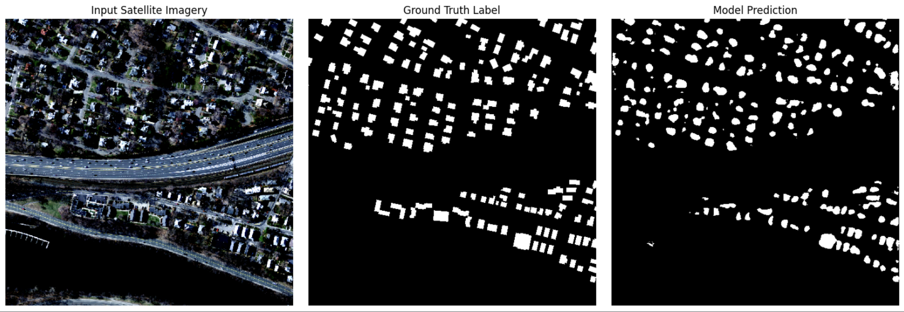

# Urban Morphology & Building Segmentation using Deep Learning

This project implements an end-to-end Deep Learning pipeline to automatically extract urban morphology metrics (Building Coverage Ratio & estimated Floor Area Ratio) from high-resolution satellite imagery.

## Project Overview
Urban planning and telecommunications (e.g., 5G network design, Fiber Optics routing) require precise building density data. Manually estimating this is prone to human bias. This project uses AI to achieve pixel-perfect accuracy.

**Key Features:**
- **Semantic Segmentation:** Uses a U-Net architecture with a ResNet50 encoder (transfer learning via ImageNet).
- **High-Res Handling:** Implements Stochastic Tiling (RandomCrop 512x512 from 1500x1500 images) to preserve architectural details without aliasing.
- **Automated Urban Metrics:** Automatically calculates the Building Coverage Ratio (BCR) directly from the model's predicted footprints.

## Tech Stack
- **Framework:** PyTorch
- **Architecture:** U-Net (smp) + ResNet50 Encoder
- **Data Augmentation:** Albumentations (Spatial & Color augmentations)
- **Loss Function:** Hybrid Loss (Dice Loss for spatial overlap + BCE Loss for stability)

## Results & Inference
The model was trained on the Massachusetts Buildings Dataset. Below is a sample inference showing the model's capability to distinguish residential footprints from dense forests and roads.

 

**Extracted Urban Metrics (Sample):**
- Total Analyzed Area: 262,144 pixels
- Building Coverage Ratio (BCR): **8.71%** (Highly accurate for suburban areas)
- Estimated Floor Area Ratio (FAR): **~0.17** (Assuming 2-story average)
